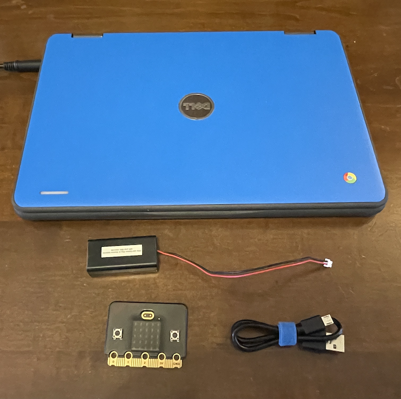
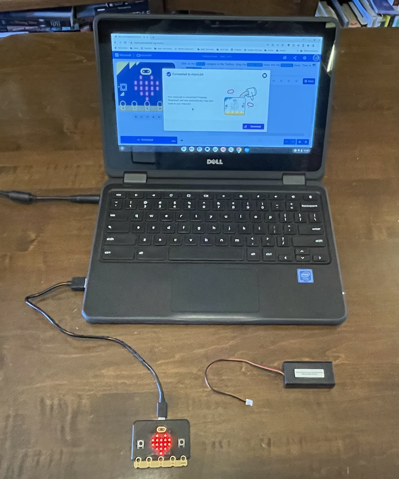
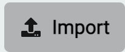
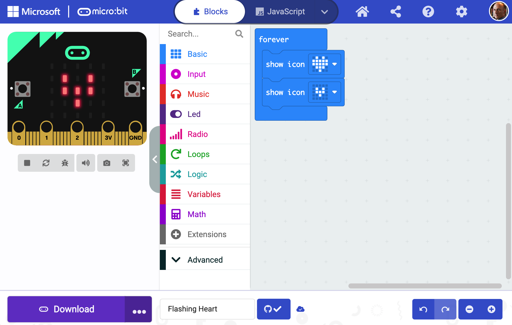
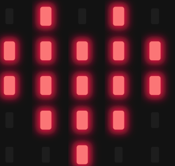

# Getting Started

To setup your microbit, you will need these things:

1. A computer with a USB port and a web browser
2. A Micro:bit
3. A USB cable. 
4. ( For later ) a battery pack



Next, just plug in the USB cable to your computer: 



Then, visit the Micro:bit MakeCode project website: [https://makecode.microbit.org](https://makecode.microbit.org)

First, click on the  button in the upper-right to create an account. 


To Load your first program, click on the Import button, which looks like this: 

In the import window, click on the middle box, "Import URL...."


Then, enter this URL:

```
https://github.com/League-Microbit/flashing-heart
```

You should see the Micro:bit editor screen, with a very simple program. 



Now, click on the purple "Download" button at the bottom of the screen, and follow the instructions for downloading the program to your Micro:bit. 

You should now see a flashing heart on your Micro:bit:



Congratulations! You have created your first Micro:bit program. 

Let's see if you can figure out how to change your flashing heart into a flashing smile and frown.

After you change your program, move on to the [first projects](/first_projects/.)
